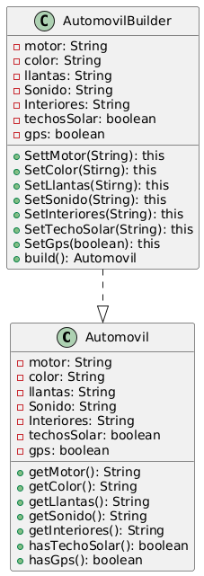

# Patrones de Diseño

## Ejercicio 1

**Tipo de patrón**: Creational


**Nombre del patrón**: Builder

El patrón Builder resuelve el problema al separar la construcción de un objeto complejo (Automóvil) de su representación final, permitiendo configurar parámetros opcionales (motor, color, techo solar, etc.) mediante métodos descriptivos y encadenados que evitan constructores sobrecargados, garantizan inmutabilidad al inicializar atributos solo una vez durante la construcción, y ofrecen flexibilidad para omitir o personalizar características sin necesidad de subclases o valores predeterminados, manteniendo el código limpio, escalable y fácil de mantener.

**Diagrama de Clases**



## Ejercicio 2

**Tipo de patrón:** Estructural

**Nombre del patrón:** Bridge (Puente)

_El patrón Bridge es un patrón de diseño estructural que permite dividir una clase grande o un conjunto de clases estrechamente relacionadas en dos jerarquías separadas: abstracción e implementación, que pueden desarrollarse de forma independiente._

Este ejercicio demuestra el patrón Bridge al separar la abstracción (notificaciones) de su implementación (por ejemplo, lógica de visualización específica de la plataforma). Esto permite extender cualquiera de los dos lados de manera independiente.

**Diagrama de Clases**


## Ejercicio 3

Por hacer

### Cómo ejecutar

Asegúrate de tener [Node.js](https://nodejs.org/) instalado.

En tu terminal, navega a la carpeta del proyecto y ejecuta:

```bash
node exercise-1/main.js
node exercise-2/main.js
```
